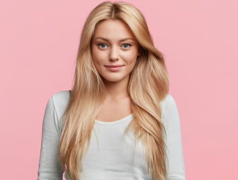
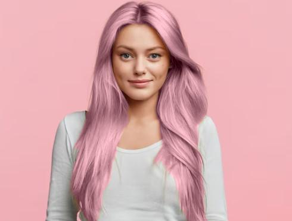
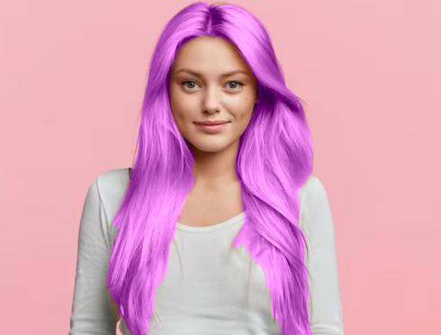
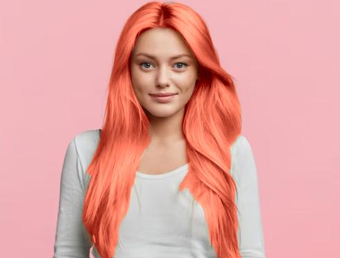
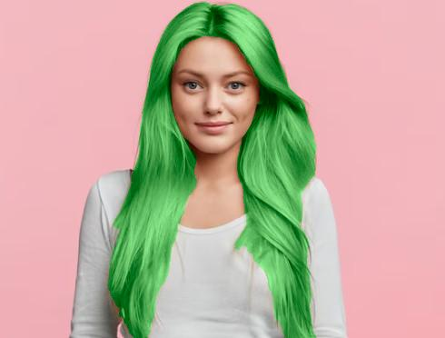

---

# Hair Color Changer using MediaPipe Segmentation

This Python script applies different hair colors to an image using hair segmentation powered by MediaPipe. You can dynamically select from multiple hair colors using command-line arguments and generate new images with colored hair.

## How It Works
- The script uses a pre-trained TFLite model for hair segmentation.
- After segmenting the hair from the input image, the script replaces the hair color with the selected color.
- Five colors are available: Pink, Violet, Maroon, Apple Green, and Orange.

## Available Hair Colors
You can choose from the following hair colors:

- Pink
- Violet
- Maroon
- Apple Green
- Orange

## Example Usage

```bash
python apply_hair_color.py --model /path/to/hair_segmenter.tflite --image /path/to/blondie.jpg --color pink --output_dir /path/to/output
```

## Sample Images

### Original Image


### Colored Hair Results
| Pink | Violet | Maroon | Apple Green |
|------|--------|--------|-------------|
|  |  |  |  |

## How to Run the Script

1. Clone this repository.
2. Make sure you have all dependencies installed:
    ```bash
    pip install numpy opencv-python mediapipe matplotlib argparse
    ```
3. Run the script with the command-line arguments:
    ```bash
    python apply_hair_color.py --model /path/to/hair_segmenter.tflite --image /path/to/blondie.jpg --color maroon --output_dir ./output
    ```

## License

This project is licensed under the MIT License.

---

